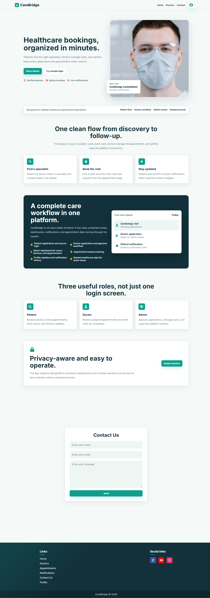
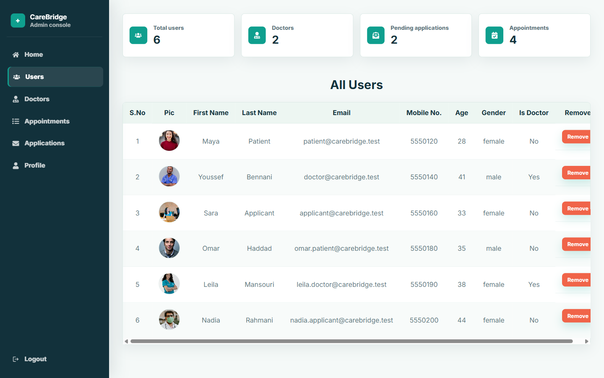
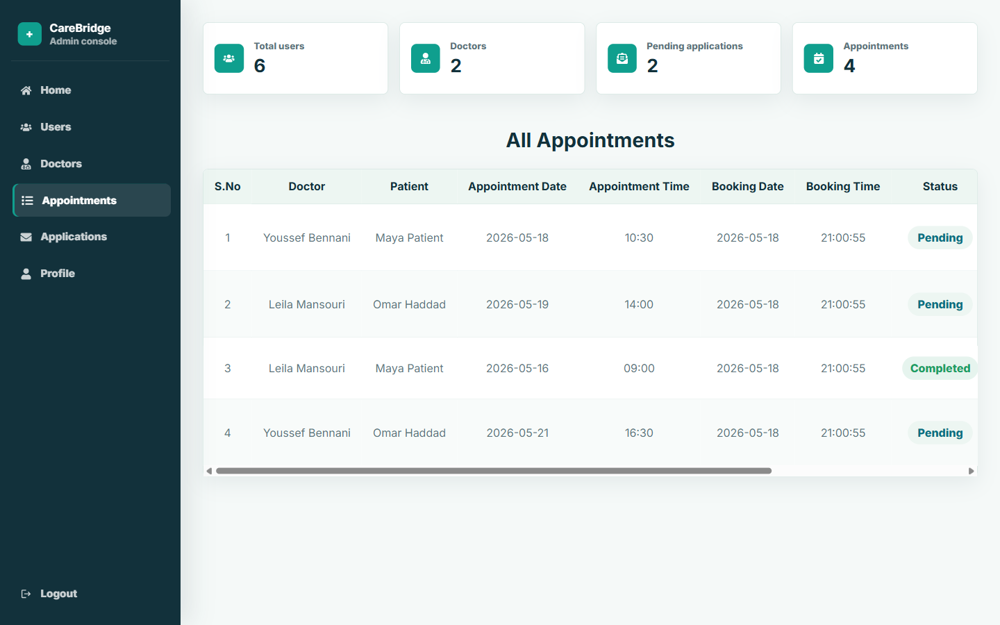
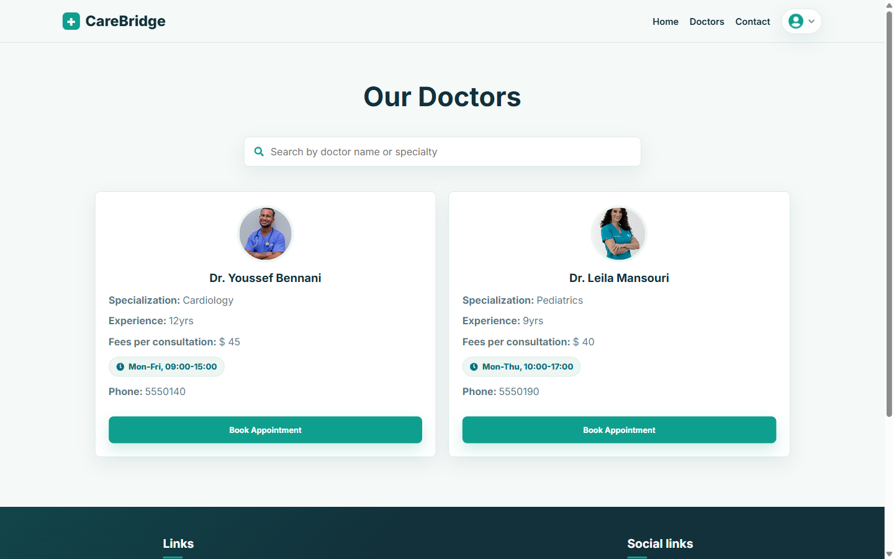
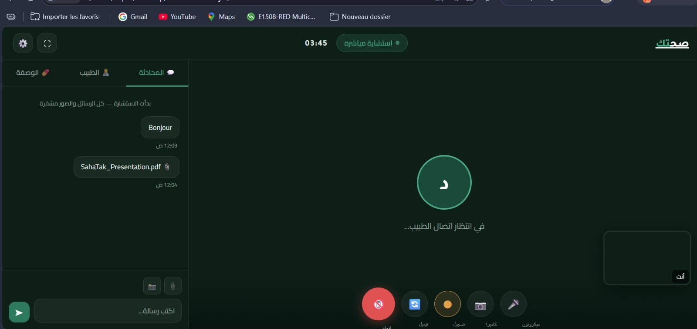

# CareBridge

CareBridge is a MERN healthcare appointment platform for patients, doctors, and administrators.

Patients can browse doctors, book appointments, manage reminders, read notifications, and update their profile. Doctors can review appointments, complete visits, and leave completion notes. Admins can manage users, doctors, applications, appointments, and dashboard analytics.

## Screenshots

### Landing Page



### Admin Dashboard



### Appointment Management



### Doctors Directory



## Next Feature: Remote Doctor Consultation

This feature is currently under development and has not been pushed into the working application yet.

The next planned CareBridge feature is a remote consultation room where a patient can talk with a doctor without visiting the clinic. The goal is to support chat, voice calls, video calls, shared medical files, and prescriptions written by the doctor during the consultation. Consultation history, uploaded files, and prescribed medicines should stay saved in the patient's appointment record so both the patient and doctor can review them later.



## Features

- Patient registration and login
- Doctor directory with availability labels
- Appointment booking and appointment status tracking
- Reminder toggle for appointments
- Doctor completion notes after visits
- Notifications for patients and doctors
- Doctor application workflow
- Admin analytics cards
- Admin management for users, doctors, applications, and appointments
- Seeded sample data for full tables during local evaluation
- MongoDB support for persistent deployments
- Local in-memory database fallback for quick setup without MongoDB

## Tech Stack

- React
- Redux Toolkit
- Node.js
- Express
- MongoDB / Mongoose
- JWT authentication
- bcryptjs

## Quick Start Without MongoDB

This mode is best for testing the full app immediately. It uses the seeded local in-memory database and resets when the server restarts.

```bash
git clone <your-repo-url>
cd carebridge
npm install
cd client
npm install
cd ..
cp .env.example .env
cp client/.env.example client/.env
npm start
```

Open:

```text
http://localhost:5000
```

## MongoDB Setup

Use this mode when you want persistent data.

1. Create a MongoDB database.

You can use either:

- MongoDB Atlas
- A local MongoDB server
- Docker MongoDB

Docker example:

```bash
docker run --name carebridge-mongo -p 27017:27017 -d mongo:7
```

2. Configure the backend environment.

Create `.env` in the project root:

```env
PORT=5000
MONGO_URI=mongodb://127.0.0.1:27017/carebridge
JWT_SECRET=replace-this-with-a-long-secret
```

For MongoDB Atlas, replace `MONGO_URI` with your Atlas connection string.

3. Configure the frontend environment.

Create `client/.env`:

```env
REACT_APP_SERVER_DOMAIN=http://localhost:5000/api
```

4. Seed the database.

```bash
npm run seed
```

5. Start the app.

```bash
npm start
```

Open:

```text
http://localhost:5000
```

## Demo Accounts

These accounts are available after using the local in-memory data or running `npm run seed`.

| Role | Email | Password |
| --- | --- | --- |
| Admin | `admin@carebridge.test` | `Admin123!` |
| Patient | `patient@carebridge.test` | `Patient123!` |
| Patient | `omar.patient@carebridge.test` | `Patient123!` |
| Doctor | `doctor@carebridge.test` | `Doctor123!` |
| Doctor | `leila.doctor@carebridge.test` | `Doctor123!` |
| Applicant | `applicant@carebridge.test` | `Apply123!` |

## Test Flow

1. Open `/`.
2. Open `/doctors` and confirm doctors show availability labels.
3. Log in as `patient@carebridge.test`.
4. Open `/appointments`.
5. Toggle an appointment reminder.
6. Open `/notifications`.
7. Log in as `doctor@carebridge.test`.
8. Open `/appointments`, add a completion note, and complete an appointment.
9. Log in as `admin@carebridge.test`.
10. Open `/dashboard/users`, `/dashboard/doctors`, `/dashboard/applications`, and `/dashboard/appointments`.
11. Confirm analytics cards and populated tables are visible.

## Scripts

```bash
npm start
```

Starts the Express server and serves the React production build from `client/build`.

```bash
npm run seed
```

Seeds a configured MongoDB database with users, doctors, applications, appointments, and notifications.

```bash
cd client
npm run build
```

Builds the React frontend.

## Notes

- If `MONGO_URI` is empty, CareBridge uses an in-memory local database with sample data.
- If `MONGO_URI` is set, run `npm run seed` once to fill MongoDB with sample data.
- Avatar image upload is optional. The app works without Cloudinary configuration and uses default/profile URLs in the seeded data.
